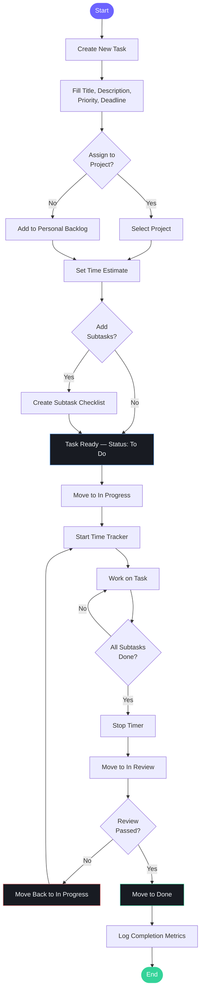
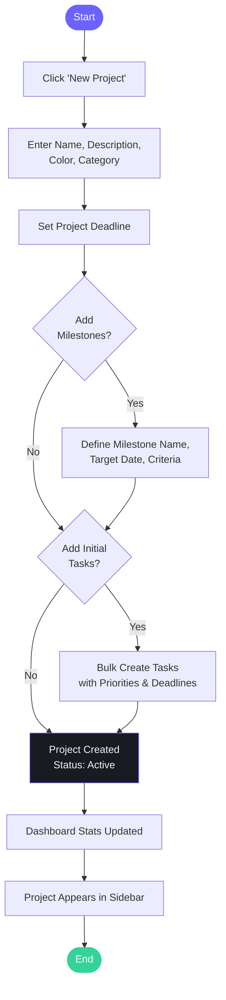
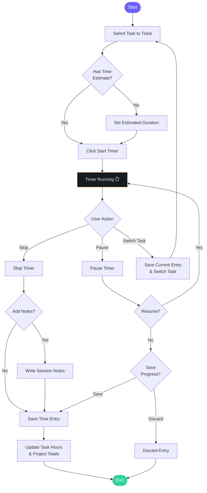
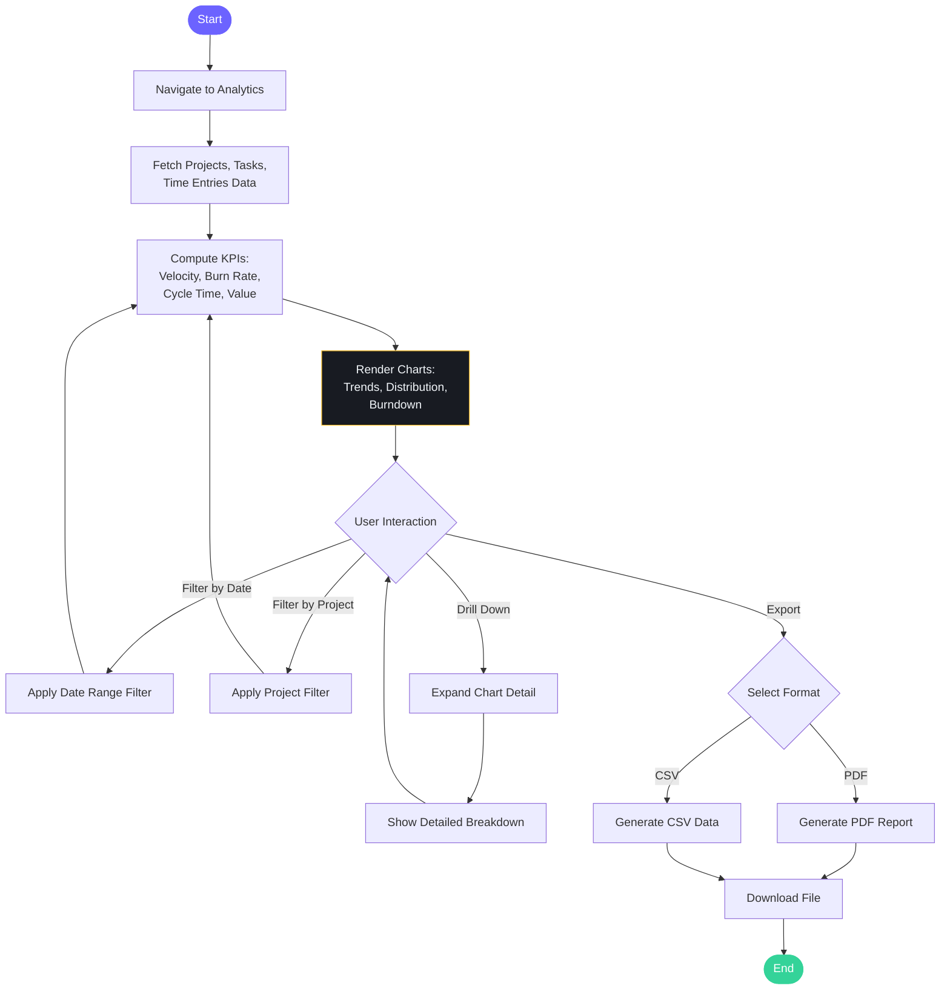

# Activity Diagrams

> Model the step-by-step workflows for key user actions.

---

## 1. Task Lifecycle — From Creation to Completion

---

## 2. Project Creation & Setup Workflow

---

## 3. Time Tracking Session Workflow

---

## 4. Analytics Report Generation Workflow

