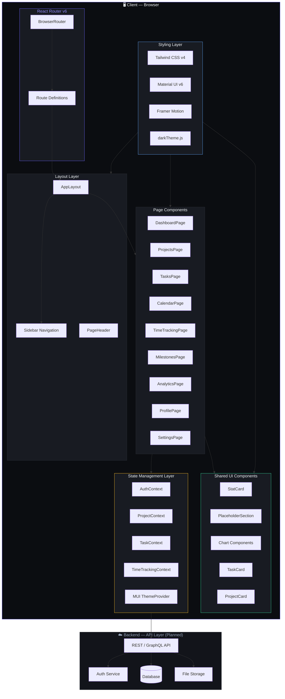

# System Architecture — Component Diagram

> Shows how the frontend layers, state management, and future backend interact.

## Layer Responsibilities

| Layer | Responsibility |
|-------|---------------|
| **Routing** | URL-to-page mapping, layout wrapping, route guards (planned) |
| **Layout** | Sidebar nav, page header, main content area with `<Outlet>` |
| **Pages** | Route-level containers, data fetching, page-specific logic |
| **Shared UI** | Reusable presentational components (cards, charts, placeholders) |
| **State** | React Context providers for auth, projects, tasks, time entries |
| **Styling** | MUI theme (dark palette), Tailwind utilities, Framer animations |
| **Backend** | API endpoints, authentication, database, file storage (planned) |
