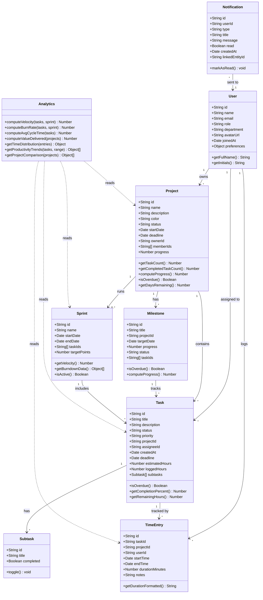

# Class Diagram — Data Models

> Defines the core entities, their attributes, relationships, and methods that will drive the dynamic state of ProjectPulse.



## Entity Relationship Summary

| Relationship | Type | Description |
|-------------|------|-------------|
| User → Project | 1:N | A user owns/manages multiple projects |
| User → Task | 1:N | A user is assigned multiple tasks |
| Project → Task | 1:N | A project contains many tasks |
| Project → Milestone | 1:N | A project has key milestones |
| Project → Sprint | 1:N | A project runs in sprints |
| Task → Subtask | 1:N | A task can have a checklist of subtasks |
| Task → TimeEntry | 1:N | Multiple time sessions per task |
| Sprint → Task | 1:N | A sprint includes a set of tasks |
| User → Notification | 1:N | Users receive deadline/status notifications |
| Analytics → All | reads | Computes metrics from projects, tasks, time, sprints |

## Enum Definitions

```
TaskStatus:    "draft" | "todo" | "in_progress" | "in_review" | "done" | "on_hold" | "cancelled"
TaskPriority:  "low" | "medium" | "high" | "critical"
ProjectStatus: "planning" | "active" | "on_track" | "at_risk" | "behind" | "completed" | "paused" | "archived"
UserRole:      "employee" | "manager" | "admin"
NotificationType: "deadline_approaching" | "task_assigned" | "review_requested" | "milestone_reached" | "status_changed"
```
