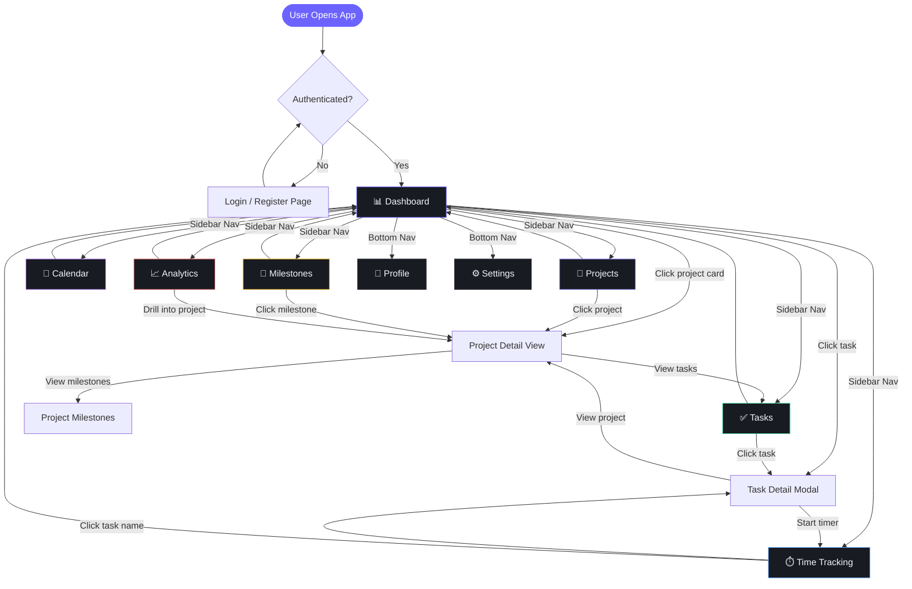
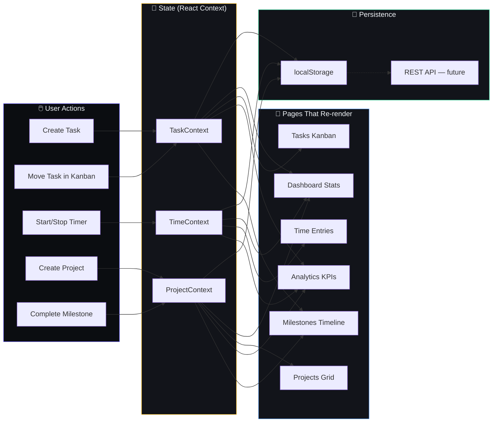
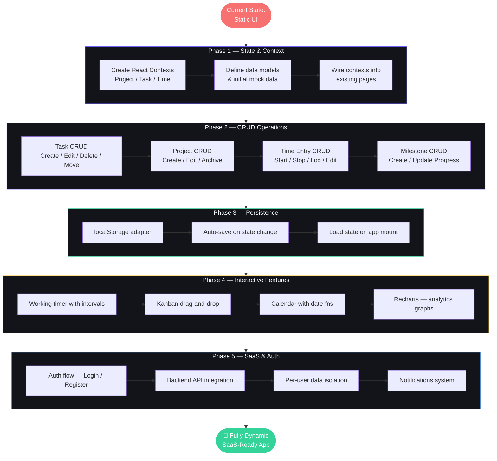
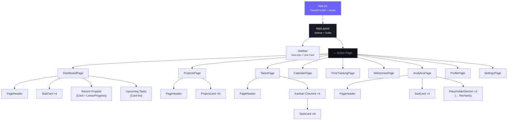

# Flowcharts — Application Navigation & User Flow

---

## 1. Complete App Navigation Flow

---

## 2. Data Flow — How State Propagates Across Pages

---

## 3. Making It Dynamic — Implementation Roadmap Flow

---

## 4. Component Hierarchy Tree

