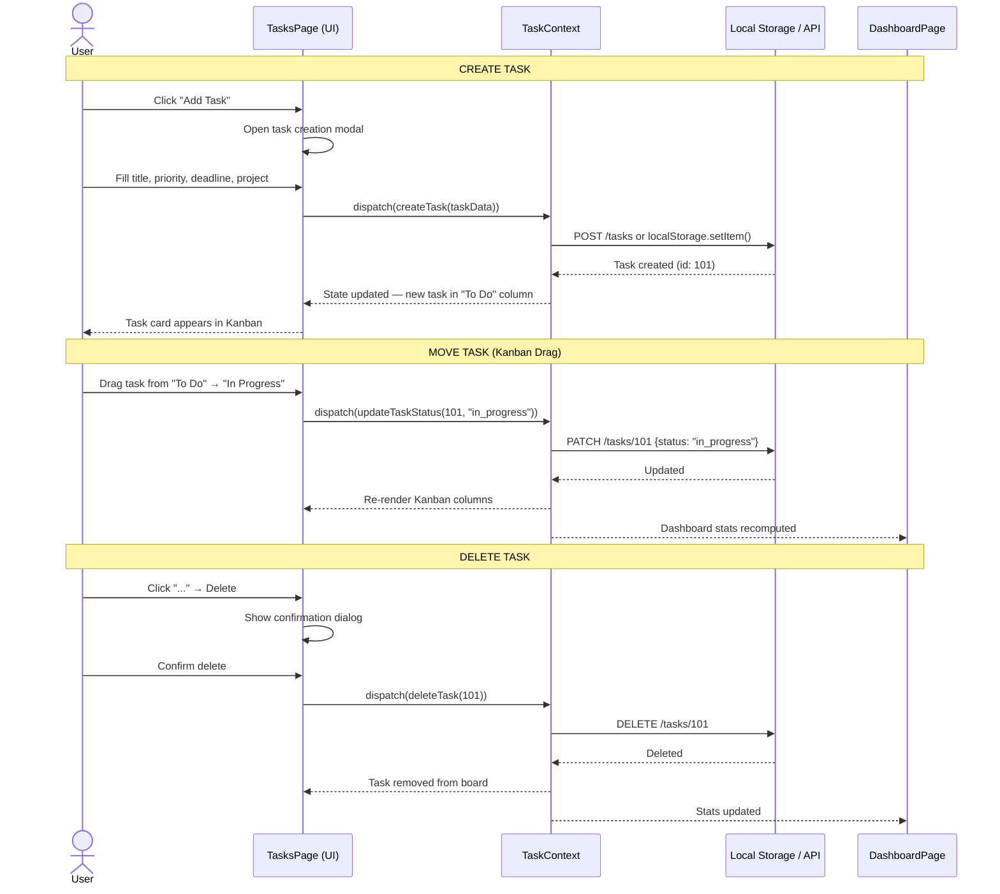
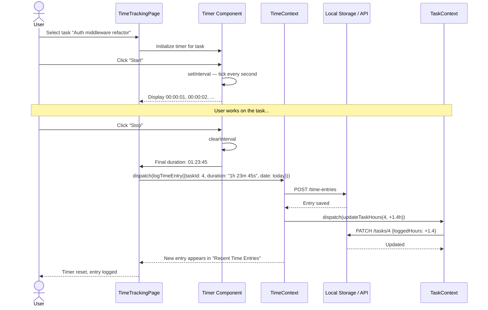
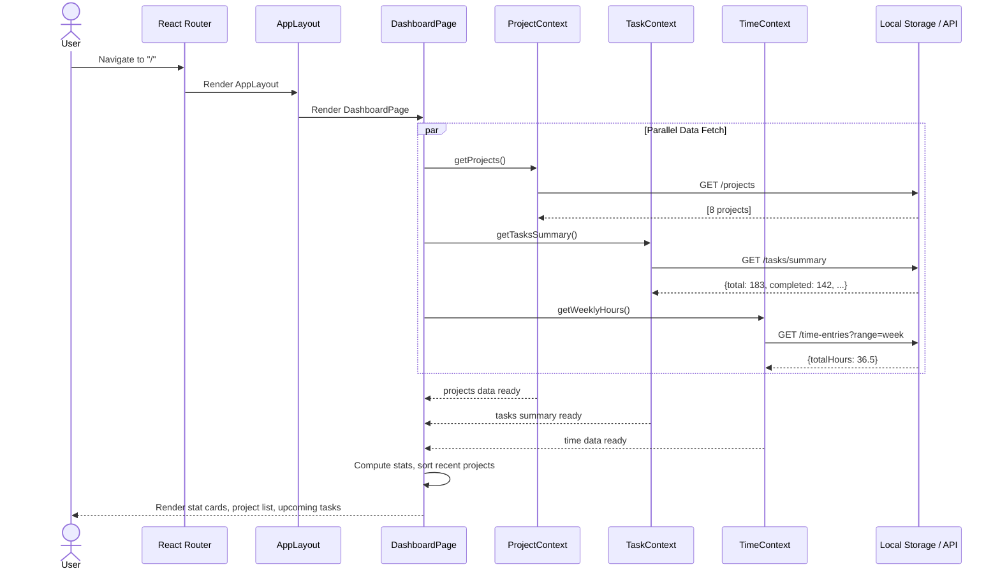
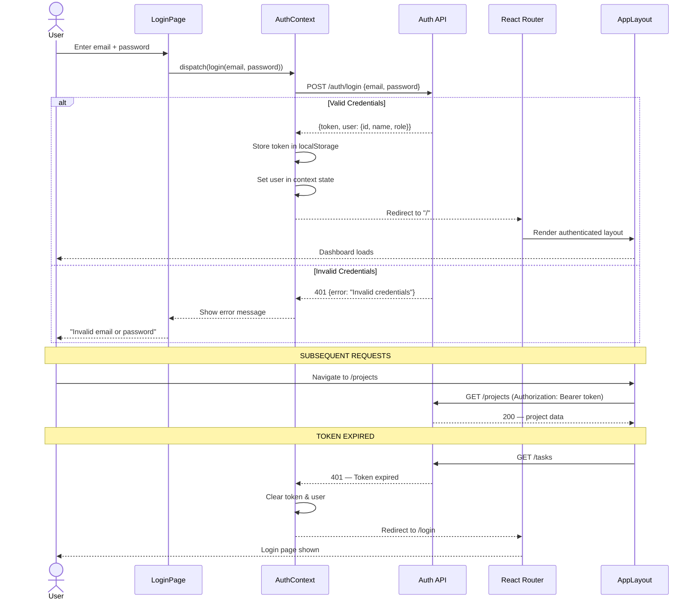
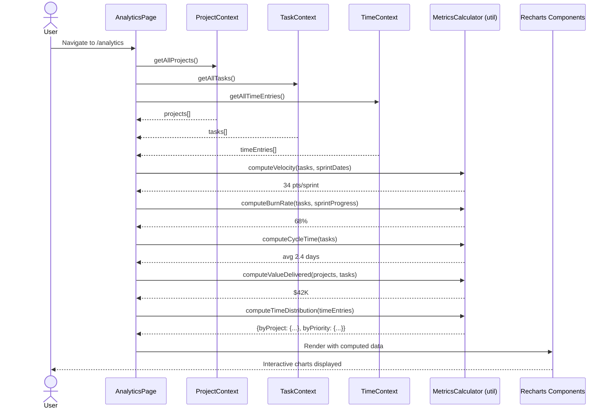

# Sequence Diagrams

> Show the interaction between components over time for key operations.

---

## 1. Task CRUD — Create, Update, Move, Delete

---

## 2. Time Tracking Session

---

## 3. Dashboard Data Loading

---

## 4. Authentication Flow (Planned)

---

## 5. Project Analytics Computation

