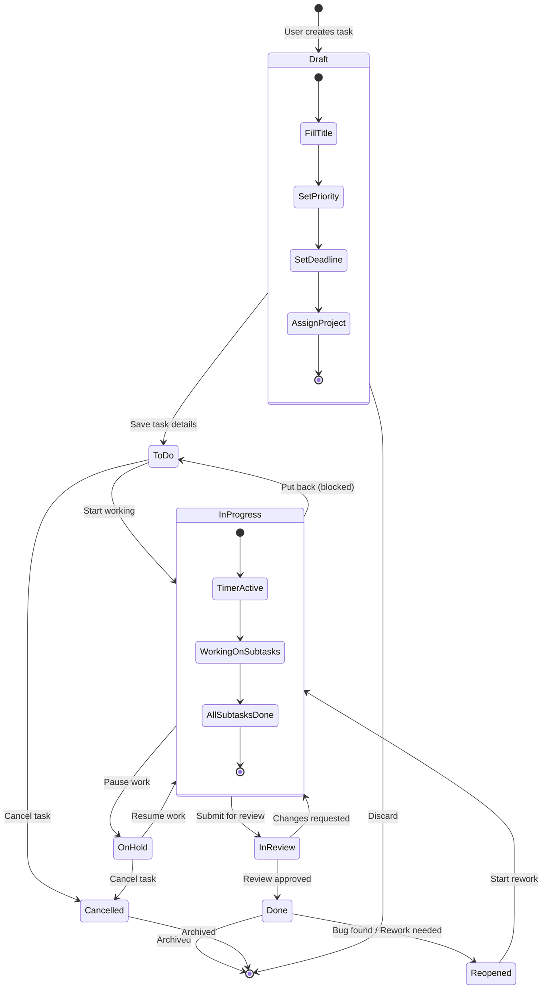
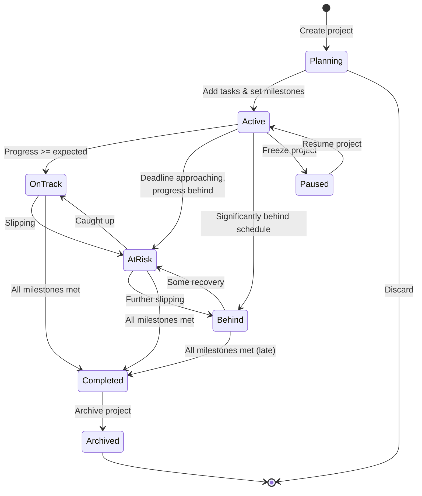
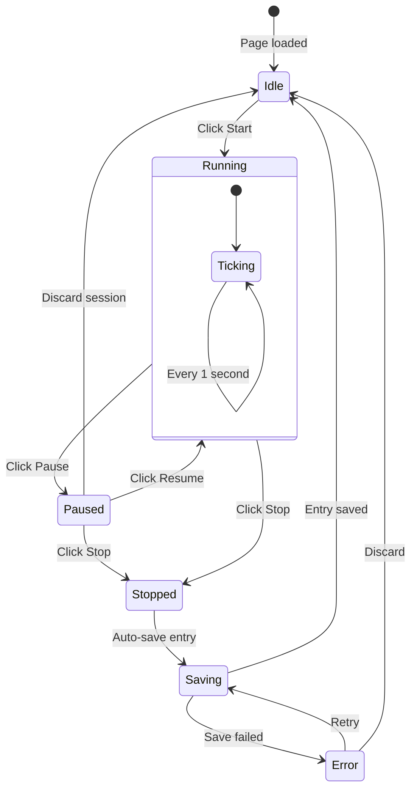
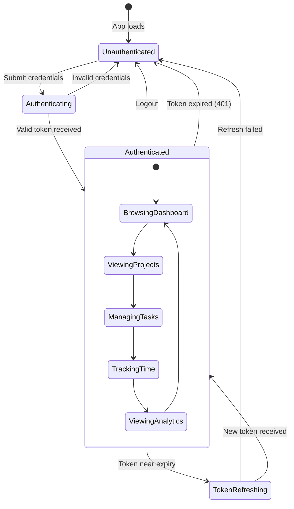

# State Diagrams

> Model the lifecycle states and transitions for key entities.

---

## 1. Task State Machine

---

## 2. Project State Machine

---

## 3. Timer State Machine

---

## 4. User Authentication State

