# Use Case Diagram

> Shows all actors and the actions they can perform within ProjectPulse.

```mermaid
graph LR
    subgraph Actors
        Employee["👤 Employee<br/>(Primary User)"]
        Manager["👔 Manager<br/>(Extended Role)"]
        System["⚙️ System<br/>(Automated)"]
    end

    subgraph ProjectManagement["📁 Project Management"]
        UC1[Create Project]
        UC2[View Project Dashboard]
        UC3[Update Project Status]
        UC4[Set Project Deadline]
        UC5[Assign Team Members]
        UC6[Archive / Delete Project]
    end

    subgraph TaskManagement["✅ Task Management"]
        UC7[Create Task]
        UC8[Assign Task to Self/Others]
        UC9[Move Task Across Kanban Columns]
        UC10[Set Task Priority & Deadline]
        UC11[Add Subtasks / Checklist]
        UC12[Filter & Search Tasks]
    end

    subgraph TimeTracking["⏱️ Time Tracking"]
        UC13[Start / Stop Timer]
        UC14[Log Manual Time Entry]
        UC15[View Time Reports]
        UC16[Estimate Task Duration]
    end

    subgraph Analytics["📊 Analytics & Metrics"]
        UC17[View Productivity Trends]
        UC18[View Sprint Velocity]
        UC19[View Time Distribution]
        UC20[Track Value Delivered]
        UC21[Export Reports]
    end

    subgraph CalendarMilestones["📅 Calendar & Milestones"]
        UC22[View Calendar Timeline]
        UC23[Create / Edit Milestones]
        UC24[Set Deadline Reminders]
        UC25[View Upcoming Deadlines]
    end

    subgraph UserAccount["👤 Account & Settings"]
        UC26[Register / Login]
        UC27[Edit Profile]
        UC28[Configure Notifications]
        UC29[Manage Integrations]
        UC30[Switch Theme Preferences]
    end

    Employee --> UC1
    Employee --> UC2
    Employee --> UC3
    Employee --> UC7
    Employee --> UC8
    Employee --> UC9
    Employee --> UC10
    Employee --> UC11
    Employee --> UC12
    Employee --> UC13
    Employee --> UC14
    Employee --> UC15
    Employee --> UC16
    Employee --> UC17
    Employee --> UC22
    Employee --> UC23
    Employee --> UC25
    Employee --> UC26
    Employee --> UC27
    Employee --> UC28
    Employee --> UC30

    Manager --> UC4
    Manager --> UC5
    Manager --> UC6
    Manager --> UC18
    Manager --> UC19
    Manager --> UC20
    Manager --> UC21
    Manager --> UC24
    Manager --> UC29

    System --> UC24
    System --> UC25
    System --> UC17

    style Actors fill:#0B0D11,stroke:#6C63FF,color:#F1F5F9
    style ProjectManagement fill:#12141A,stroke:#6C63FF,color:#F1F5F9
    style TaskManagement fill:#12141A,stroke:#34D399,color:#F1F5F9
    style TimeTracking fill:#12141A,stroke:#60A5FA,color:#F1F5F9
    style Analytics fill:#12141A,stroke:#FBBF24,color:#F1F5F9
    style CalendarMilestones fill:#12141A,stroke:#C084FC,color:#F1F5F9
    style UserAccount fill:#12141A,stroke:#F87171,color:#F1F5F9
```

## Use Case Summary

| Module | Use Cases | Primary Actor |
|--------|-----------|---------------|
| Project Management | Create, view, update, deadline, assign, archive | Employee + Manager |
| Task Management | CRUD, kanban, priority, subtasks, search | Employee |
| Time Tracking | Timer, manual entry, reports, estimation | Employee |
| Analytics | Trends, velocity, distribution, value, export | Employee + Manager |
| Calendar & Milestones | Timeline, milestones, reminders, deadlines | Employee + Manager + System |
| Account & Settings | Auth, profile, notifications, integrations, theme | Employee + Manager |
